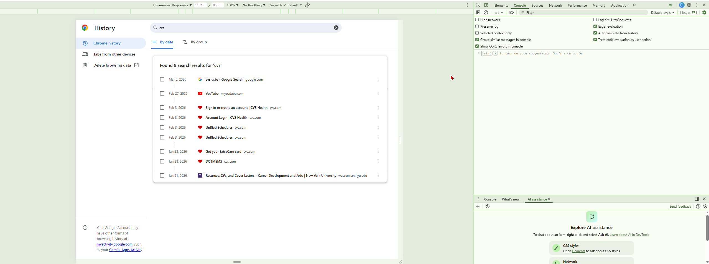
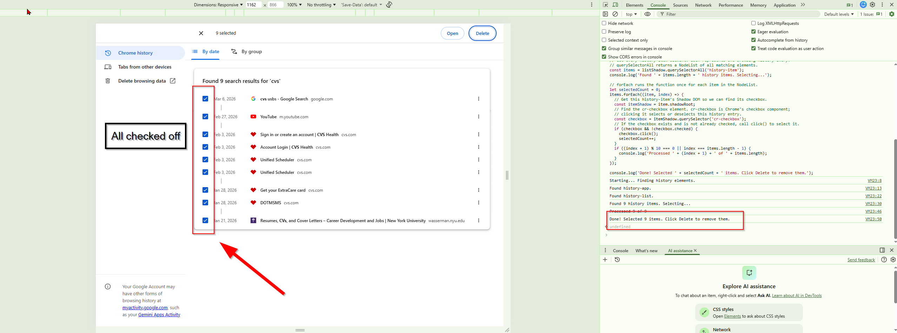

# Chrome History Bulk Delete

A lightweight JavaScript script that lets you **select and delete specific search results in bulk** on Chrome's History page (`chrome://history`). No more clicking each checkbox one by one.

---

## Project Description

### What It Does

This script runs in the Chrome Developer Tools console. After you search for a keyword on the History page, it automatically selects all matching history items so you can delete them in one click.

### Motivation

Manually selecting dozens or hundreds of history entries is tedious. This tool removes that friction and gives you better control over your browsing data—helping you clear items you don't want others to see.

### Problem It Solves

- **Tedious selection:** Avoid clicking every checkbox individually when cleaning up history.
- **Data control:** Quickly remove sensitive or unwanted entries from your feed.
- **Time savings:** Bulk operations instead of repetitive manual steps.

### Technologies Used

- **JavaScript** (vanilla, no dependencies)
- **Chrome DevTools Console** (no installation required)

### Challenges Faced

The main challenge was **finding the correct internal structure** of Chrome's History page. The UI is built with Web Components and Shadow DOM, so the script had to traverse `history-app` → `history-list` → `history-item` and their respective `shadowRoot`s to reach the checkboxes.

### Possible Future Improvements

- One-click delete button (select and delete in a single action)
- Chrome extension for easier access
- Integration with a script library extension for Chrome

---


## Installation

No installation is required. The script runs directly in the Chrome browser.


## Usage

### Step-by-Step Instructions

1. Open Chrome and go to **`chrome://history`**.
2. Use the search bar to filter history by keyword (e.g., `cvs`, `youtube`, `login`).
3. Press **F12** (or right-click → Inspect) to open Developer Tools.
4. Go to the **Console** tab.
5. Paste the script and press **Enter**.
6. Return to the History page and click the **Delete** button to remove the selected items.

### Example Workflow

```
1. Search "cvs" on chrome://history
2. Paste script in Console (F12) → Enter
3. Script selects all 9 matching items
4. Click "Delete" on the History page
5. Done!
```

### Screenshots

**Before:** History page with search results—no items selected yet.



**After:** All matching items are selected; click Delete to remove them.



---

## Contributing

Contributions are welcome. Feel free to:

- Open issues for bugs or feature requests
- Submit pull requests with improvements

---

## Credits

- **Built with:** [Cursor Composer 1.5](https://cursor.com/)
- **README guide:** [How to Write a Good README File for Your GitHub Project](https://www.freecodecamp.org/news/how-to-write-a-good-readme-file/) (freeCodeCamp)

---

## License

This project is open source and available for anyone to use and modify. See the [LICENSE](LICENSE) file for details.

---

## AI Assistance Disclosure

This project was developed with the assistance of AI tools. AI was used to help generate code suggestions, documentation, and implementation ideas.

All AI-generated content was reviewed, tested, and modified by the author before being included in this repository. The author maintained a human-in-the-loop (HITL) workflow, meaning that AI outputs were treated as suggestions and not accepted without verification.

The author remains fully responsible for the design, implementation, and correctness of the final code.

**Further reading:** [Notes on HITL](images/Notes%20on%20HITL.pdf) — Notes on AI and human-in-the-loop concepts.